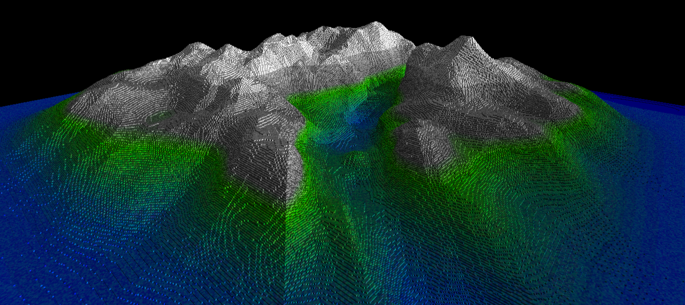

<h1 align="center">Coperium Voxels</h1>

<p align="center">
  
</p>

<h2 align="center"><em>A novel data structure for voxel rendering</em></h2>

<p align="center">
  <strong>Keith Farrugia</strong>  
  <br/>
  University of Malta
  <br/>
  Supervisor: Dr Keith Bugeja 
  <br/>
  Co-Supervisor: Dr Sandro Spina
</p>

<p align="center">
  
</p>

---

## Overview

*Coperium Voxels* is a voxel-based 3D rendering and interaction system developed as part of my final year dissertation at the University of Malta. The project explores efficient voxel data structures, real-time rendering techniques, and interactive editing capabilities.

---

## Prerequisites

To build and run this project, ensure you have the following installed:

- **Visual Studio 2022** with the following workloads:
  - **Desktop Development with C++**
- **Windows 10 SDK** (typically included with Visual Studio)

---

## Building and Running the Project

1. **Clone the Repository**
   ```bash
   git clone https://github.com/KeithFarrugia/Coperium-Voxels.git
   cd Coperium-Voxels
2. **Open the Solution**

   * Launch **Visual Studio 2022**.
   * Open the `Coperium Voxels.sln` solution file.

3. **Build the Solution**

   * Select the desired build configuration (**Debug** or **Release**).
   * Press `Ctrl + Shift + B` to build the solution.

4. **Run the Application**

   * Set the startup project if not already set:

     * Right-click on the desired project in the **Solution Explorer**.
     * Select **Set as Startup Project**.
   * Press `F5` to run the application.

---

## 🎮 Controls

* **W, A, S, D**: Move forward, left, backward, and right relative to the camera’s facing direction.
* **Space**: Move up.
* **Left Shift**: Move down.
* **Scroll Wheel**: Zoom the camera in and out.
* **Tab**: Unlocks the mouse cursor for free movement, but is somewhat unstable — may require multiple presses and can be finicky.
* **Window Resizing**: The application window can be resized, but this feature is unstable and **not recommended** for regular use.

---

## Default World Selection (Using `Create_Default_World`)

The project provides several **default world presets** that you can choose from when initializing the `WorldManager` class **and calling the `Create_Default_World` function**.

### How to Set the Default World

When creating a `WorldManager` instance, you specify the world by passing a string name to its constructor. If you are passing the world through the `Create_Default_World` function this name will be used to pick a pre-configured setup:

```cpp
WorldManager world("mount");
Create_Default_World(world);
```

Replace `"mount"` with one of the supported world preset names to load a specific world configuration.

| **World Name** | **Description**                                                                                     |
| :------------: | :-------------------------------------------------------------------------------------------------- |
|     `mount`    | Static model world loaded from heightmap data. Procedural generation disabled.                      |
|    `sponza`    | Static model world using sky-blue color mapping. Procedural generation disabled.                    |
|    `canway`    | Runs Conway's Game of Life simulation within the voxel world. No chunk loading/saving.              |
|     `wave`     | Procedurally generates a wave-like landscape with static chunks.                                    |
|    `dynamic`   | Dynamic world with automatic chunk loading/unloading and file storage enabled. Procedural disabled. |

---

## 🌍 World Settings

The `world_settings_t` struct contains configuration options for world loading, rendering, level of detail, generation, and debugging. Below is a description of each setting:

### General Settings Table

|        **Setting**       |     **Type**    |  **Default**  | **Description**                                     |
| :----------------------: | :-------------: | :-----------: | :-------------------------------------------------- |
|        `mass_load`       |      `bool`     |    `false`    | Load entire world from save during initialization   |
|        `auto_load`       |      `bool`     |    `false`    | Automatically load new chunks as needed             |
|       `auto_unload`      |      `bool`     |    `false`    | Automatically unload chunks that are far away       |
|  `allow_load_from_file`  |      `bool`     |     `true`    | Permit loading chunks from disk                     |
| `allow_chunk_generation` |      `bool`     |     `true`    | Allow procedural generation of chunks               |
|    `allow_chunk_store`   |      `bool`     |     `true`    | Allow saving chunks back to disk                    |
|      `render_world`      |      `bool`     |     `true`    | Enable rendering of the world                       |
|      `mesh_changes`      |      `bool`     |     `true`    | Allow updates to chunk meshes                       |
|   `update_interval_ms`   |      `int`      |     `500`     | Minimum milliseconds between mesh updates           |
|         `use_lod`        |      `bool`     |     `true`    | Enable level-of-detail (LOD) based mesh detail      |
|       `dynamic_lod`      |      `bool`     |     `true`    | Recompute LOD on camera movement                    |
|      `smart_update`      |      `bool`     |     `true`    | Skip LOD update if camera hasn't moved              |
|         `lod_set`        | `lod_dst_set_t` | *(see below)* | Distance thresholds for different LOD levels        |
|      `chunk_radius`      |      `int`      |      `1`      | Radius in chunks around the player to generate/load |
|      `generic_chunk`     |     `Chunk`     |    *(none)*   | Prototype chunk used for mesh generation            |
|      `smart_render`      |      `bool`     |     `true`    | Render only chunks visible to the player            |
|          `debug`         |      `bool`     |    `false`    | Enable debug logging                                |

---

### LOD Distance Thresholds (`lod_set`)

| **LOD Level** | **Distance Threshold (units²)** |  **Calculation**  |
| :-----------: | :-----------------------------: | :---------------: |
|    `NORMAL`   |             `2500.0`            |  `50.0f * 50.0f`  |
|    `LOD_2`    |            `10000.0`            | `100.0f * 100.0f` |
|    `LOD_4`    |            `40000.0`            | `200.0f * 200.0f` |
|    `LOD_8`    |            `160000.0`           | `400.0f * 400.0f` |

---
